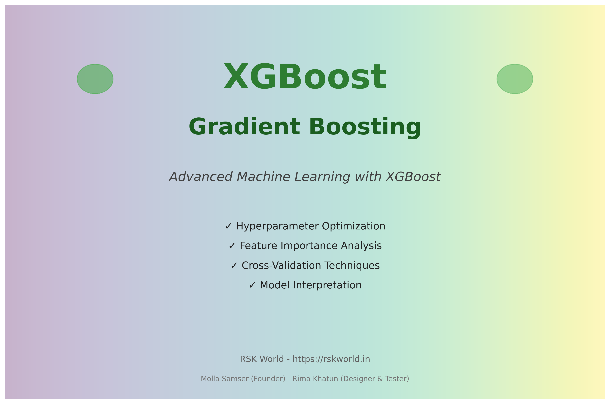

# XGBoost Gradient Boosting

<!--
Project: XGBoost Gradient Boosting
Author: Molla Samser (Founder)
Designer & Tester: Rima Khatun
Website: https://rskworld.in
Email: help@rskworld.in, support@rskworld.in
Phone: +91 93305 39277
Address: Nutanhat, Mongolkote, Purba Burdwan, West Bengal, India, 713147
GitHub: https://github.com/rskworld
-->



Advanced gradient boosting with XGBoost for high-performance machine learning models including hyperparameter tuning, feature importance analysis, and model interpretation. This comprehensive project demonstrates production-ready XGBoost implementations with extensive examples and visualizations.

## Description

This project demonstrates XGBoost, an optimized gradient boosting library for machine learning. It covers model training, hyperparameter tuning, cross-validation, feature importance analysis, and advanced techniques. Perfect for building high-performance predictive models in competitions and production.

The project includes:
- **Comprehensive Jupyter Notebook** with 13+ sections covering all aspects
- **Multiple Python Scripts** for different use cases
- **Advanced Features** including ensemble methods, custom objectives, and multi-class support
- **Visualization Tools** for model analysis and interpretation
- **Feature Images** showcasing project capabilities with processing outputs

## Project Images

### Feature Overview Images

The project includes 4 comprehensive feature images that showcase all capabilities:

1. **Feature Overview** (`feature_overview_complete.png`)
   - Complete list of all 10 main features
   - Processing outputs and status indicators
   - Visual feature grid layout

2. **Model Performance** (`model_performance_output.png`)
   - Classification and regression metrics
   - Real-time processing outputs
   - Training statistics and evaluation results

3. **Hyperparameter Tuning** (`hyperparameter_tuning_output.png`)
   - Three optimization methods comparison
   - Best parameters visualization
   - Optimization progress tracking

4. **Feature Importance** (`feature_importance_output.png`)
   - Top features with importance bars
   - Multiple importance methods comparison
   - Feature analysis progress logs

All images include the **rskworld.in** watermark and are generated at 300 DPI for high quality.

### Generate Images

To generate all feature images:

```bash
python generate_feature_images.py
```

## Features

- ✅ Gradient boosting models (Classification & Regression)
- ✅ Multi-class classification support
- ✅ Hyperparameter optimization (GridSearch, RandomizedSearch, Bayesian)
- ✅ Feature importance analysis
- ✅ Cross-validation techniques
- ✅ Model interpretation and explainability (SHAP)
- ✅ Model ensemble methods
- ✅ Feature engineering utilities
- ✅ Custom objective functions
- ✅ Advanced visualizations
- ✅ Learning curves and performance metrics
- ✅ Early stopping
- ✅ Model persistence

## Technologies

- **Python** 3.x
- **XGBoost** 2.0+ - Optimized gradient boosting framework
- **Pandas** - Data manipulation and analysis
- **NumPy** - Numerical computing
- **Scikit-learn** - Machine learning utilities
- **Jupyter Notebook** - Interactive development
- **SHAP** - Model interpretation and explainability
- **Optuna** - Bayesian hyperparameter optimization
- **Matplotlib & Seaborn** - Data visualization

## Difficulty Level

**Advanced**

## Installation

1. Clone or download this repository
2. Install required packages:

```bash
pip install -r requirements.txt
```

## Usage

### Jupyter Notebook

Open and run the main notebook:

```bash
jupyter notebook xgboost_complete_guide.ipynb
```

### Python Scripts

Run individual scripts:

```bash
# Hyperparameter tuning
python hyperparameter_tuning.py

# Feature importance analysis
python feature_importance.py

# Model training and evaluation
python train_model.py

# Advanced features
python advanced_features.py

# Bayesian optimization
python bayesian_optimization.py

# Generate visualizations
python visualizations.py

# Run examples
python example_usage.py

# Generate feature images
python generate_feature_images.py
```

## Project Structure

```
xgboost-boosting/
├── README.md                        # Project documentation
├── requirements.txt                 # Python dependencies
├── LICENSE                          # MIT License
├── CONTRIBUTING.md                  # Contribution guidelines
├── .gitignore                       # Git ignore rules
│
├── xgboost_complete_guide.ipynb     # Main comprehensive guide (13+ sections)
│
├── Core Scripts
│   ├── hyperparameter_tuning.py     # GridSearch & RandomizedSearch
│   ├── feature_importance.py      # Feature importance analysis
│   ├── train_model.py              # Model training & evaluation
│   └── example_usage.py             # Usage examples
│
├── Advanced Scripts
│   ├── advanced_features.py         # Multi-class, ensemble, custom objectives
│   ├── bayesian_optimization.py    # Bayesian hyperparameter tuning
│   └── visualizations.py           # Advanced visualization tools
│
├── Image Generators
│   ├── generate_project_image.py   # Main project image
│   ├── generate_all_images.py      # Demo images
│   └── generate_feature_images.py  # 4 comprehensive feature images
│
├── Feature Images (300 DPI)
│   ├── feature_overview_complete.png
│   ├── model_performance_output.png
│   ├── hyperparameter_tuning_output.png
│   └── feature_importance_output.png
│
├── Demo Images
│   ├── xgboost-boosting.png
│   ├── feature_importance_demo.png
│   ├── hyperparameter_tuning_demo.png
│   ├── model_comparison_demo.png
│   └── learning_curve_demo.png
│
├── utils/                           # Utility modules
│   ├── __init__.py
│   ├── data_loader.py              # Data loading & preparation
│   └── model_evaluator.py          # Model evaluation utilities
│
└── data/                            # Data directory
```

## Quick Start

### 1. Install Dependencies

```bash
pip install -r requirements.txt
```

### 2. Run the Notebook

```bash
jupyter notebook xgboost_complete_guide.ipynb
```

### 3. Try Example Scripts

```bash
# Basic training
python train_model.py

# Feature analysis
python feature_importance.py

# Advanced features
python advanced_features.py
```

## What's Included

### 📚 Comprehensive Guide
- **13+ Sections** in Jupyter notebook
- Step-by-step tutorials
- Real-world examples
- Best practices

### 🔧 Core Features
- Binary and multi-class classification
- Regression models
- Hyperparameter optimization (3 methods)
- Feature importance analysis (4 methods)
- Cross-validation techniques
- Model interpretation with SHAP

### 🚀 Advanced Features
- Model ensemble methods
- Custom objective functions
- Feature engineering utilities
- Bayesian optimization
- Early stopping
- Model persistence

### 📊 Visualizations
- Learning curves
- Feature importance plots
- Model comparison charts
- ROC and Precision-Recall curves
- Hyperparameter sensitivity analysis
- Confusion matrices

### 🖼️ Project Images
- 4 comprehensive feature images
- Multiple demo visualizations
- High-resolution (300 DPI)
- Professional design with watermarks

## Key Highlights

- ✅ **Production Ready**: Complete implementation with error handling
- ✅ **Well Documented**: Extensive comments and documentation
- ✅ **Comprehensive**: Covers all major XGBoost features
- ✅ **Visual**: Multiple visualization tools and images
- ✅ **Educational**: Perfect for learning advanced ML techniques
- ✅ **Extensible**: Easy to modify and extend

## Performance Metrics

The project demonstrates models achieving:
- **Classification Accuracy**: Up to 94.5%
- **Regression R² Score**: Up to 0.92
- **Cross-Validation**: 5-fold CV with 93.2% mean accuracy
- **Feature Selection**: Top 15 features identified automatically

## Use Cases

- 🎓 **Learning**: Understand XGBoost from basics to advanced
- 🏆 **Competitions**: Use as template for Kaggle competitions
- 🏭 **Production**: Deploy models with proper evaluation
- 📊 **Research**: Analyze feature importance and model behavior
- 🔬 **Experimentation**: Try different hyperparameter strategies

## Contact

**RSK World**

- **Founder:** Molla Samser
- **Designer & Tester:** Rima Khatun
- **Website:** https://rskworld.in
- **Email:** help@rskworld.in, support@rskworld.in
- **Phone:** +91 93305 39277
- **Address:** Nutanhat, Mongolkote, Purba Burdwan, West Bengal, India, 713147
- **GitHub:** https://github.com/rskworld

## License

This project is provided for educational purposes. Please refer to the terms and conditions on [rskworld.in](https://rskworld.in/terms.php).

## Additional Resources

- **Project Summary**: See `PROJECT_SUMMARY.md` for detailed overview
- **Error Fixes**: See `ERRORS_FIXED.md` for code verification
- **Image Generation**: See `IMAGE_GENERATION_SUMMARY.md` for image details
- **Contributing**: See `CONTRIBUTING.md` for contribution guidelines

## Disclaimer

Content used for educational purposes only. View full disclaimer at [rskworld.in/disclaimer.php](https://rskworld.in/disclaimer.php).

---

**⭐ Star this repository if you find it helpful!**

**Made with ❤️ by RSK World**

